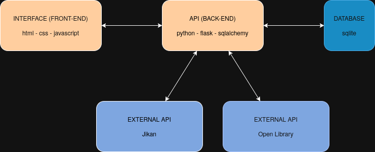

# Media Archive - Front-End

A responsive web application for tracking and managing your media consumption (books, movies, manga, anime, series) with progress tracking, comments functionality, and external API integration for fetching media information.

This project was made as part of the PUC-RJ post-graduation course.
[API](https://github.com/Luxxdev/mvp-api)


## Architecture



The application follows a three-tier architecture:
- **Front-End**: HTML, CSS, and Vanilla JavaScript
- **API (Back-End)**: Python Flask REST API
- **Database**: SQLite with SQLAlchemy ORM
- **External APIs**: Jikan API (anime/manga) and Open Library API (books)

## Features

- **Media Management**: Add, edit, and delete media items
- **External API Integration**: Search and import media information from Jikan (anime/manga) and Open Library (books)
- **Progress Tracking**: Track your current progress (chapters read, episodes watched, pages read, etc.)
- **Comments System**: Add, edit, and delete comments on your media items
- **Search Functionality**: Filter your media collection by name
- **Category Organization**: Organize media by type (Movie, Book, Manga, Anime, Series)
- **Completion Status**: Mark items as completed or in-progress
- **User Scoring**: Rate media items from 0-10
- **Date Tracking**: Record when you started consuming each media

## Technologies Used

- **HTML5**: Semantic markup structure
- **CSS3**: Modern styling with custom properties and responsive design
- **Vanilla JavaScript**: Dynamic functionality and API interactions with async/await
- **Flatpickr**: Date picker library for enhanced date selection
- **Fetch API**: RESTful API communication with the backend

## Project Structure

```
front-end/
├── index.html          # Main HTML structure
├── styles.css          # CSS styling and responsive design
├── script.js           # JavaScript functionality and API integration
├── fluxogram.png       # System architecture diagram
└── README.md          # This file
```

## Setup and Installation

### Prerequisites

- A modern web browser (Chrome 60+, Firefox 55+, Safari 12+, Edge 79+)
- The Media Archive API running on `http://127.0.0.1:5000` (see API README for setup)

### Installation

#### Option 1: Using Docker (Recommended)

1. **Clone the repository**:
   ```bash
   git clone https://github.com/Luxxdev/mvp-front-end.git
   ```

2. **Build and run the Docker container**:
   ```bash
   docker build -t media-archive-frontend .
   docker run -d -p 80:80 --name media-archive-frontend media-archive-frontend
   ```

3. **Access the application**:
   - Open your browser and navigate to `http://localhost`

4. **Ensure the API is running**:
   - Navigate to the `api` folder and follow the setup instructions in its README
   - The API should be accessible at `http://127.0.0.1:5000`

#### Option 2: Without Docker

1. **Clone the repository**:
   ```bash
   git clone https://github.com/Luxxdev/mvp-front-end.git
   cd mvptemp/front-end
   ```

2. **Ensure the API is running**:
   - Navigate to the `api` folder and follow the setup instructions in its README
   - The API should be accessible at `http://127.0.0.1:5000`

3. **Open the application**:
   - Simply open `index.html` in your web browser
   - Or use a local server for better performance:
     ```bash
     # Using Python
     python -m http.server 8000
     
     # Using Node.js (http-server)
     npx http-server
     ```

## Usage Guide

### Adding New Media

1. Click **"Add something!"**
2. Select category (Anime, Manga, or Book)
3. Start typing the title (search triggers after 2+ characters)
4. Browse through API results displayed below
5. Click on a result to auto-fill information
6. Add your personal progress and score
7. Click **"Add"** to save

### Managing Media

- **View Details**: Click on any media card to view/edit details
- **Edit**: In the modal, modify any field and click **"Update"**
- **Delete**: Click the **"×"** button in the top-right corner of any media card
- **Search**: Use the search box to filter media by name
- **Clear Search**: Click "Search" with an empty box to show all media

### Managing Comments

- **Add Comment**: 
  1. Click **"New"** in the comments section of a media card
  2. Type your comment
  3. Click **"Submit"**

- **View Comments**: Click **"View Comments"** / **"Hide Comments"** to toggle visibility

- **Edit Comment**: 
  1. Click on any comment text
  2. The comment becomes editable
  3. Modify the text
  4. Click **"Save"** or **"Cancel"**

- **Delete Comment**: 
  1. Click on a comment to edit it
  2. Click the **"Delete"** button


## API Integration

The front-end communicates with the Flask API through these endpoints:

### Media Endpoints
- `GET /medias` - Retrieve all media items
- `GET /media?id={media_id}` - Get specific media
- `POST /media` - Create new media
- `PATCH /media?id={media_id}` - Update media
- `DELETE /media?id={media_id}` - Delete media

### Comment Endpoints
- `POST /comment` - Add new comment
- `PATCH /comment` - Update comment
- `DELETE /comment?id={comment_id}` - Delete comment

### External API Endpoint
- `GET /search?query={search_term}&category={category}` - Search external APIs

## Code Structure

### Main Components

#### Initialization (`script.js`)
- Constants and configuration
- DOM element references
- Event listeners setup
- Initial data loading

#### Display Functions
- `openMediaModal()` / `closeMediaModal()` - Modal management
- `displayMedias()` - Render media grid
- `createCard()` - Generate media card HTML
- `createAPIInfoBox()` - Display external API results

#### Data Management
- `insertElement()` / `deleteElementDisplay()` - Local array updates
- `updateElementDisplay()` - Sync UI with data changes
- `searchMedia()` - Filter media by search term

#### API Communication
- `getMedias()` / `postMedia()` / `patchMedia()` / `deleteMedia()` - Media operations
- `postComment()` / `patchComment()` / `deleteComment()` - Comment operations
- `searchExternalAPI()` - External API search

## Styling

The application features a modern, clean design with:

- **Color Scheme**: 
  - Primary: Light blue (`#4a90e2`)
  - Background: Light gray (`#f5f5f5`)
  - Cards: White with shadows
  
- **Typography**: Verdana font family for readability

- **Interactive Elements**: 
  - Smooth hover transitions
  - Button states (hover, active)
  - Modal overlays

- **Accessibility**: 
  - Semantic HTML
  - Keyboard navigation support
  - Focus indicators

## Known Limitations

- **External API Availability**: 
  - Movie and Series search not yet implemented (TMDB integration planned)
  - API results depend on external service availability

- **Data Persistence**: All data is stored on the backend; clearing browser cache doesn't affect saved media

- **Rapid Actions**: Quick successive clicks on delete/update buttons may cause synchronization issues

- **Network Dependency**: Requires active connection to the API server

## Browser Compatibility

Tested and supported on:
- Chrome 60+
- Firefox 55+
- Safari 12+
- Edge 79+

## Performance Considerations

- **Lazy Loading**: Images use lazy loading for better performance
- **Debouncing**: Search input is debounced (500ms) to reduce API calls
- **Efficient Rendering**: Only affected elements are re-rendered on updates

## License

This project is for educational purposes.

## Related Links

- [Jikan API Documentation](https://docs.api.jikan.moe/)
- [Open Library API Documentation](https://openlibrary.org/developers/api)

